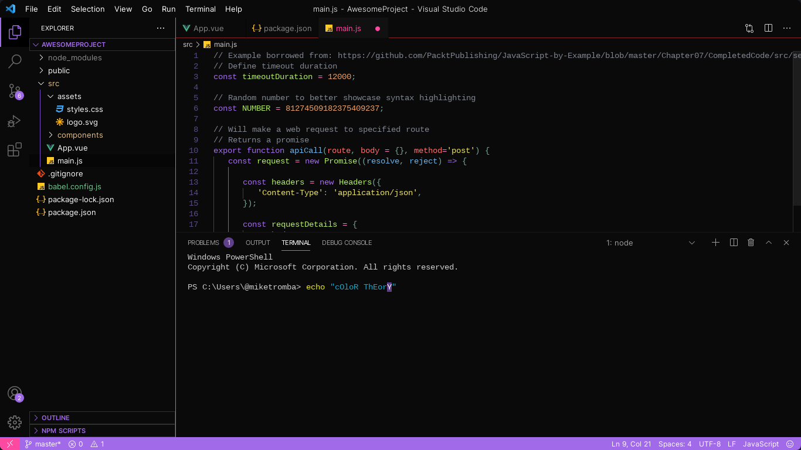

# Violetta Dark VSCode Theme

*It's always hard to find the perfect coding theme because there are so many out there. That's why I created Violetta, my first VSCode theme! It's a dark theme with the purple color scheme. I hope you'll enjoy while you're coding.*

*Any feedback is appreciated, thanks <3*

## Preview

  
      
  
      
  

**Happy Coding!**

> Made By @s-shemmee
